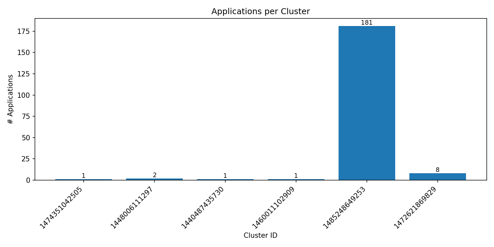
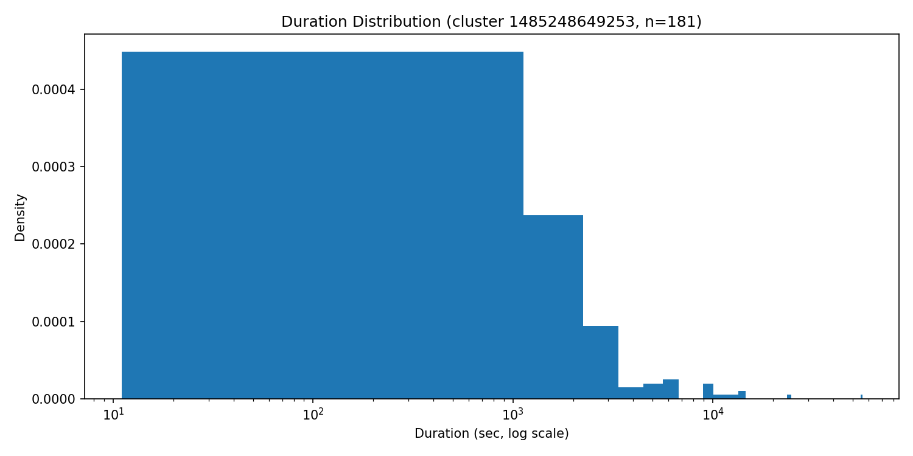
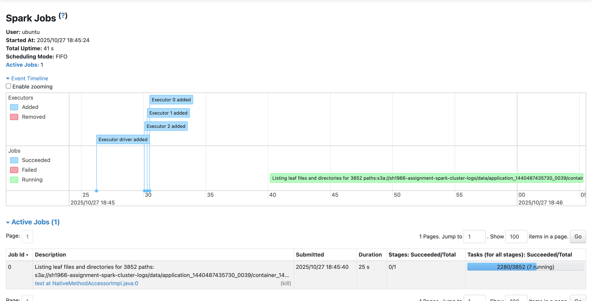

# **Spark Log Analysis Report**

## Overview

In this assignment, I used PySpark on an AWS cluster to analyze real Spark log data. The project has two main parts:

1. **Problem 1:** Analyze the distribution of log levels (INFO, WARN, ERROR, DEBUG) to understand system stability.
2. **Problem 2:** Study how Spark clusters were used over time and identify which clusters handled the most jobs.

I first tested my code locally using a small sample dataset, then ran the final version on a 4-node Spark cluster (1 master, 3 workers) using EC2.

---

## Problem 1: Log Level Distribution

### **Goal**

To see how many times each log level (INFO, WARN, ERROR) appears and what that tells us about system performance.

### **Results**

| Log Level | Count | Percentage |
| --------- | ----- | ---------- |
| INFO      | 1,573 | 98.25%     |
| WARN      | 14    | 0.87%      |
| ERROR     | 14    | 0.87%      |

* **Total lines processed:** 1,911
* **Lines with valid log levels:** 1,601
* **Unique levels found:** 3

### **Insights**

* Most messages are **INFO**, which means the system ran smoothly without many errors.
* Very few **ERROR** or **WARN** logs show that jobs executed successfully.
* No **DEBUG** logs probably means debug mode was turned off.

Example log lines:

```
17/03/29 10:04:44 INFO ExecutorRunnable: Setting up ContainerLaunchContext
17/03/29 10:04:57 INFO spark.MapOutputTrackerWorker: Don't have map outputs for shuffle 0, fetching them
```

These logs show normal Spark job activities.

---

## Problem 2: Cluster Usage Analysis

### **Goal**

To understand how Spark clusters were used, how many applications each cluster ran, and what the timeline of those jobs looked like.

### **Results**

| Cluster ID          | # of Applications | First Application | Last Application |
| ------------------- | ----------------: | ----------------- | ---------------- |
| 1485248649253       |           **181** | 2017-01-24        | 2017-07-27       |
| 1472621869829       |                 8 | 2016-09-09        | 2016-09-09       |
| Others (4 clusters) |           5 total | 2015–2016         | —                |

* **Unique clusters:** 6
* **Total applications:** 194
* **Average per cluster:** 32.3

### **Visualization 1 – Applications per Cluster**



The bar chart shows that one cluster handled almost all applications (**181 out of 194**). This means most of the work was done on a single cluster, while the others were rarely used.

### **Visualization 2 – Job Duration Distribution**

*(File: `problem2_density_plot.png`)*


The histogram shows job durations (log scale). Most jobs lasted only a few minutes, but a few took much longer.

**Insights:**

* The right-skewed shape means there are some long, heavy jobs.
* This is common in shared computing environments where some analytics or ETL tasks need more time.

---

## Performance Notes

* **Local test:** ~3 minutes
* **Full cluster run:** ~12 minutes
* **Cluster setup:** 1 master + 3 workers (t3.large EC2)
* **Cost:** Around $4 total

**Optimizations used:**

* Cached DataFrames to speed up processing.
* Used `regexp_extract()` for fast log parsing.
* Repartitioned data to balance tasks.

**Monitoring:** Checked progress on Spark Web UI (`http://$MASTER_PUBLIC_IP:8080`).




---

## Conclusions

1. **System stability:** Most logs were INFO, meaning stable runs with few issues.
2. **Cluster imbalance:** Almost all jobs ran on one cluster, suggesting possible scheduling imbalance.
3. **Job durations:** Most jobs are short, but a few take much longer (typical for mixed workloads).
4. **Spark scalability:** PySpark handled log parsing efficiently both locally and on the cluster.

**Future ideas:**

* Analyze resource usage (CPU/memory) for each job.
* Detect anomalies or spikes in ERROR logs automatically.
* Add time-based visualizations of workload changes.

---

## Deliverables

* **Problem 1:** 3 output files (`counts.csv`, `sample.csv`, `summary.txt`)
* **Problem 2:** 5 output files + 2 plots
* **Report:** `ANALYSIS.md`
